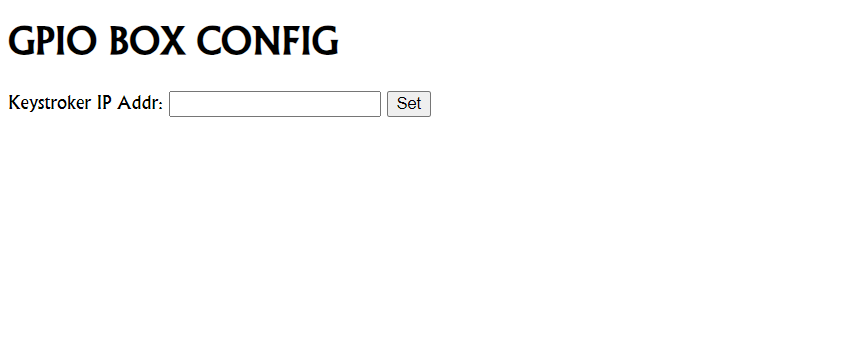
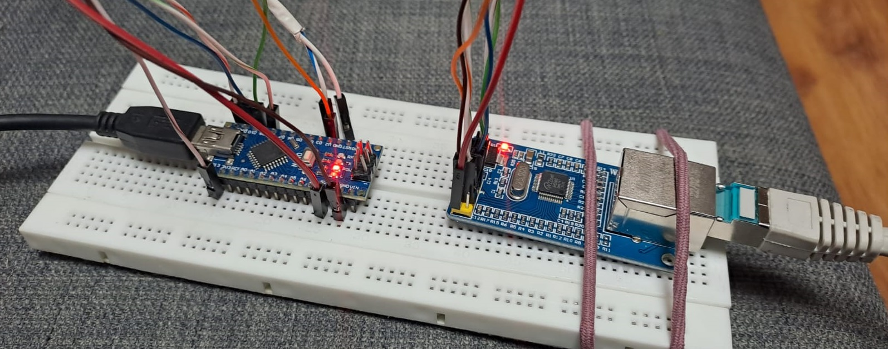
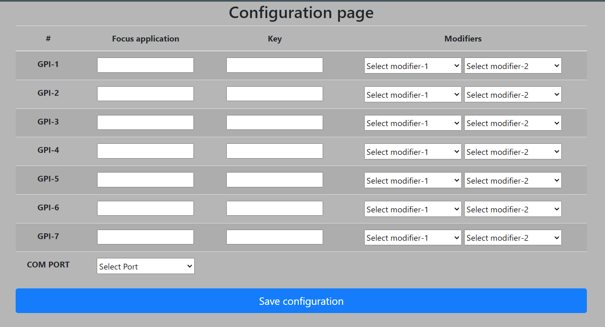

# nodejs-keystroker 

## Main Concept

The main concept is to have GPIO box that can be connected to gpo providers and trigger app focus and keystroke sends. 
so, we have 2 different parts here:

### GPIO-BOX:

In this project i use arduino nano ATMega328, with ETH W5500 module. In sketch, we use Ethernet2 library.
In general, it can:
 - Send GET request to keystroker (we can change the keystroker IP in arduino web config page).
 - Handle GPI on digital pins as trigger to initiate GET request.
 - Serve basic web config page to set arduino and keystroker IP. Those 2 parameters are cached in EEPROM.

### Nodejs application:

Nodejs runs on client, listens to serial or HTTP triggers, and fires keystrokes.

It uses robotjs library to send keys, and node-window-manager to set application focus. 

It also provide web config page to map GPI's to focus application and keystroke. 

Also, for serial connection, we can set serial port.

