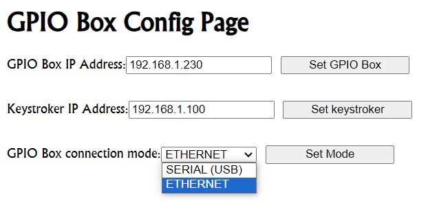
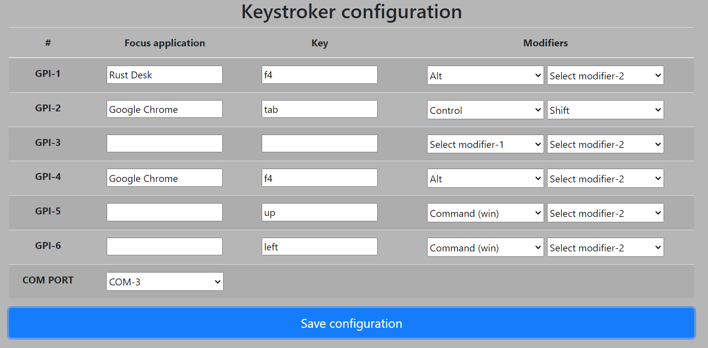

# nodejs-keystroker 

## Main Concept

The primary goal is to develop a GPIO box that connects to GPIO providers, enabling the triggering of app focus and keystroke transmission. This setup involves a GPIO box and a Node.js application:

### Terms
keystroker - A Node.js application running on a client PC, designed to receive GPI triggers.
GPIO Box - An Arduino Nano micro-controller.

### GPIO-BOX:

For this project, I'm using an Arduino Nano ATMega328 paired with an ETH W5500 module. The Ethernet2 library is employed in the sketch.
In general, it can:

- Register digital pins shortcuts (6 pins are implemented).
- Sending GET requests to keystroker, (the IP address for keystroker can be adjusted on the Arduino web configuration page).
- Serve a basic web config page to set GPIO Box ip, keystroker ip, and connection mode (ethernet/serial (usb)). These 3 parameters are stored in EEPROM, so GPIO Box "remember" them after restart.




### Nodejs application:

NThe Node.js application operates on the client side, monitoring both serial and HTTP triggers to execute keystrokes.

It utilizes the robotjs library for key transmission and node-window-manager for managing application focus.

Additionally, a web configuration page is provided to map GPIs to specific applications and keystrokes. Those settings are cached, and keystroker will "remember" them after reset.

For serial connection, the serial COM port can be configured.



### Protocol
Upon a pin being shorted, the Arduino will send an HTTP request or a serial message. 
Conversely, keystroker is designed to listen for both serial and HTTP messages. 
Therefore, keystroker accommodates both connection types, while the GPIO Box must be set to one of these modes. 
Theoretically, the GPIO Box could trigger both serial and HTTP responses, but if the network destination is unavailable, it would temporarily halt the main process. This could be addressed by implementing asynchronous techniques, but it would complicate the project. 
I've decided to leave it as is for now.

* HTTP Protocol Specification: The keystroker application listens on the route /api/gpi/{gpi_num}. The Arduino sketch is configured with 6 pins (D3-D8) to function as GPI. To activate the Arduino, one of D3-D8 pins need to be shorted to GND.

* Serial Protocol Specification: The keystroker's serial listener responds to the string "GPI {gpi_num} FIRED!".

* Arduino pin Mapping:
D3 pin ==> ```/api/gpi/1```, and serial ```GPI 1 FIRED!```.
D4 pin ==> ```/api/gpi/2```, and serial ```GPI 2 FIRED!```.
D5 pin ==> ```/api/gpi/3```, and serial ```GPI 3 FIRED!```.
D6 pin ==> ```/api/gpi/4```, and serial ```GPI 4 FIRED!```.
D7 pin ==> ```/api/gpi/5```, and serial ```GPI 5 FIRED!```.
D8 pin ==> ```/api/gpi/6```, and serial ```GPI 6 FIRED!```.

The reason for -2 shift is to create flat construction. 
The Arduino internal wiring is out of end user scope.

